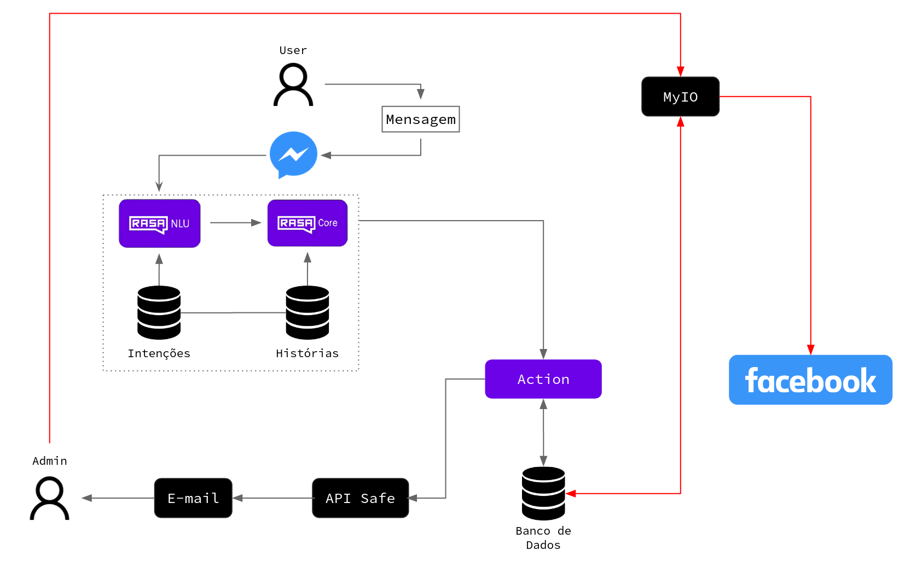

# O Projeto
Um chatbot construído utilizando [Rasa](https://rasa.com/), integrado ao facebook messenger, capaz de automatizar o processo de obtenção e estruturação de informações, enviar emails e realizar publicações posts na página do facebook.

## Escopo
A beneficiária desse projeto integrava a equipe de uma ONG de auxílio a animais, a qual recebia possuía e possuia um abrigo físico de animais. Infelizmente a ONG perdeu o apoio e, posteriormente, se desfez. Mas, com a intenção de continuar ajudando os animais, a beneficiária encontrou outra forma de agir. Para cuidar dos animais necessitados, ela criou uma página no facebook, a [Patinhas de Rua](https://www.facebook.com/PatinhasDeRuaMirandopolis) para escutar e auxiliar os habitantes da cidade em relação aos animais.

Essa página recebe diversas solicitações de resgate e doação de animais, de modo que a beneficiária pode ajudar de maneira independente ou, quando estiver impossibilitada de ajudar, realizar publicações para divulgar a situação e encontrar pessoas que possam ajudar.

## O problema
O auxílio aos animais provido pela beneficiária é um trabalho não remunerado, por isso ela possui um emprego formal, o qual ocupa parte de seu tempo e dificulta a leitura e resposta das mensagens enviadas a página em um curto período de tempo.

Devido a isso, o chatbot foi desenvolvido no intuito de facilitar a comunicação entre os habitantes da cidade e a página Patinhas de Rua, auxiliando na obtenção e estruturação das informações, possibilitando o repasse das informações coletadas a responsável pela página. Além disso, o chatbot também é capaz de realizar publicações na página, quando solicitado.

## Funcionalidades
O Chatbot tem por objetivo interpretar as mensagens enviadas a página para os seguintes fluxos de conversa: 
* Resgate de um animal abandonado
* Doação de um Animal
* Ajuda financeira para a página
* FAQ com dúvidas recorrentes.

Para os principais serviços, como Resgate de Animal e Doação de Animal, o Chatbot realizará perguntas para obter os dados pessoais (do usuário que entrou em contato com a página), dados do animal a ser resgatado e a localização onde o animal se encontra.

Após obter todas as informações necessárias, os dados serão estruturados e enviados por email para a beneficiária e ela tomará as medidas cabíveis ao caso.

O email possuirá um botão que, quando clicado, realizará uma publicação de maneira automatizada dos dados exibidos no corpo do email na página do Facebook. Como é comum que os usuários enviem fotos, também foi necessário adicionar ao bot a funcionalidade de identificar nudez, sangue ou conteúdo ofensivo nas imagens, evitando assim que uma publicação viole as diretrizes do Facebook.

### Arquitetura do projeto
<p align="center">
  
</p>

# Tecnologias utilizadas
* Python 3.8.10
* Rasa 3.0.3
* Spacy 3.2.1
    * Modelo <em>pt_core_news_lg</em>
* Pymongo 3.10.1
* MongoDB
* [Jinja2](https://jinja.palletsprojects.com/en/3.0.x/)
* [Facebook-sdk](https://github.com/mobolic/facebook-sdk)
* [Duckling](https://github.com/facebook/duckling)
* Docker 20.10.8 e Docker-compose 1.29.2
* [SightEngine API](https://sightengine.com/)


# Executando o projeto
O projeto está todo dockerizado, basta apenas configurar as variáveis de ambiente, como será descrito abaixo.
## Configurando variáveis de ambiente
Algumas variáveis de ambiente são obtidas através de processos de configuração externos
ao projeto, como, por exemplo, a integração do chatbot com o Facebook, que gera os tokens de acesso a página. Para isso é necessário acessar a página do [facebook developers](https://developers.facebook.com), logar com a conta do Facebook que possui a página, criar um APP e
linka-lo com a página. Após esse processo serão obtidos identificadores e tokens de acesso necessários para o projeto. Detalhes podem ser encontrados na [documentação oficial do facebook](https://developers.facebook.com/docs/development/).

Além disso, para verificar a existência de nudez, sangue ou conteúdo ofensivo nas imagens utilizamos a [SightEngine API](https://sightengine.com/). Esse serviço necessita de cadastro e fornece as credenciais para o uso da API.

A tabela abaixo exibe as variáveis de ambiente necessárias e uma breve descrição de cada uma.
Obs: as variáveis de ambiente que devem ser escritas em um arquivo chamado ```rasa.env```. Nesse repositório existe um arquivo de exemplo, chamado ```example-rasa.env```, não se esqueça se remover o "example" quando for utilizá para definir as variáveis de ambiente.

| Nome | Descrição |
| --------------- | --------------- |
| ```EMAIL_SENDER``` | Email do remetente. Email que irá enviar os dados extraídos pelo bot durante uma conversa ao email receptor. Ex: email@example.com |
| ```EMAIL_SENDER_SENHA``` | Senha do email do remetente. Caso o email escolhido utilize a autenticação de dois fatores será necessário definir uma "senha para aplicativos". Para emails de domínio gmail basta seguis as intruções desse [documento](https://support.google.com/accounts/answer/185833?hl=pt-BR) |
| ```EMAIL_RECEIVER``` | Email receptor. Email que receberá os dados. Ex: email@example.com |
| ```DEVELOPER_APP_NAME``` | Nome do APP criado no facebook developers. |
| ```DEVELOPER_APP_SECRET``` | Secrect key. Informação obtida no facebook developers. |
| ```PAGE_ACESS_TOKEN``` | Token de acesso a página, obtido no facebook developers. |
| ```PAGE_POST_ACESS_TOKEN``` | Token de acesso a publicações na página, obtido no facebook developers. |
| ```MONGO_URI``` | URL de conexeão com o banco de dados. |
| ```ENABLE_SAFE_API``` | Valor booleano que define se as imagens serão avaliadas pela API que busca nudez, sangue ou contéudo ofensivo. Quando definido como False, as imagens não passam por nenhuma validação, porém isso é informando no corpo do email enviado ao receptor. Além disso, o botão de poblicação automática, presente no email enviado, é removido, forçando com que receptor do email precise criar a publicação manualmente. Isso garante que não aconteçam cliques indesejados sem a prévia avaliação as imagens. Ex: True,False |
| ```SAFE_API_TOKEN``` | Token de acesso a API, obtida no site [SightEngine API](https://sightengine.com/) após o cadastro. |
| ```SAFE_API_USER_ID``` | Identificador obtido no site [SightEngine API](https://sightengine.com/) após o cadastro. |

## Criand os containers
```
docker-compose up
```